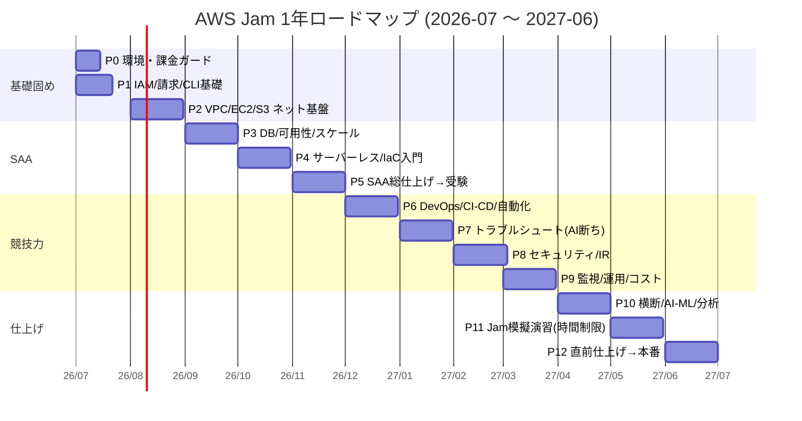

# AWS Jam 3位入賞 ― 1年間ハンズオン・ロードマップ

Refs #1 #3

## このロードマップの考え方
- **逆算**: Jam は「実シナリオを時間内に自力で解く」競技。よって *知識の暗記* より *手を動かす速度と切り分け力* を育てる。
- **背骨は SAA**: 体系知識は SAA 学習で固め、毎週ハンズオンで肉付けする。
- **AI の使い分け**:
  - 準備（教材・採点スクリプト・復習問題・IaC 雛形の生成）→ **バイブコーディング活用 OK**
  - 競技模擬（Jam 想定の課題）→ **生成 AI 禁止で解く**。本番の手応えを再現する。
- **粒度**: 1フェーズ = 約1ヶ月（週3〜5h × 4週 = 12〜20h）。各フェーズは「到達目標／ハンズオン／成果物／チェック」を持つ。

## 全体像

> ⚠️ **開催月は要確認**: このガントは「AWS Summit 2027 Japan = 2027-06」を仮定（近年は6月開催）。もし4-5月開催なら P10〜P12 が後ろにずれて崩壊するため、**正式日程が出たら早めに全体を前倒し**する。各フェーズは1ヶ月枠だが工数は12〜20hなので余白があり、遅延・SAA再受験(14日待機)はこの余白＋必要なら1フェーズ削って吸収する。
> 各フェーズの月は固定ではなく**前後1ヶ月のバッファ前提**。遅れたら無理に詰めず、優先度の低い P10 の幅広部分から削る。

---

## Phase 0 ― 環境・課金ガード整備（2026-07 前半 / 約4h）
**到達目標**: 安心して壊して学べる AWS 環境を持つ。請求事故を防ぐ。

**ハンズオン**
- AWS アカウント作成（既にあれば確認）。ルートユーザーに MFA。**作業用 IAM 管理者ユーザーにも MFA を付ける**。
- 作業用 IAM ユーザー（管理者）を作り、以後ルートは使わない。長期アクセスキーは作らない／作っても短命運用（理想は IAM Identity Center の短期クレデンシャル）。
- **CLI は名前付きプロファイル `jam` を新設**して使う（`aws configure --profile jam`、region=`ap-northeast-1`）。既存の `default`（別プロジェクト用）は触らず、学習コマンドは常に `--profile jam` を付けて誤爆を防ぐ。プロファイル命名と手順は成果物 `knowledge/00-env-setup.md` に記録する。
- **このプロジェクトのアカウントは最初から従量課金**（既存 AWS 顧客が新規作成したため、新 Free Tier の Freeプラン・$200クレジット対象外）。Free Tier の緩衝も自動停止ガードも無い前提で運用する。詳細は `research/aws-free-tier-2025.md`。
- **Budgets で月額アラート**（例: 1,000円 / 3,000円で通知）。Cost Explorer 有効化。
  - ⚠️ **Budgets は「支出を止める」仕組みではない**。あくまで通知で、反映は最大1日遅れる。自動停止ガードが無いぶん、下記の即時削除運用が唯一の実効的な歯止めになる。

**🚨 コスト事故ガード（最重要・全フェーズ共通）**
- このアカウントは従量課金・自動停止無し。**規律でしか止められない**ことを肝に銘じる。
- **時間課金リソースは「そのセッション内で必ず削除し、請求/残高を目視確認」**。週末までためない。特に以下は放置すると月数千円予算を即超過する:
  - NAT Gateway（東京 約$0.06/h + データ処理料、放置で月$40超）
  - RDS Multi-AZ / Aurora / ElastiCache / ALB（いずれも時間課金で放置厳禁。このアカウントは Free Tier が無いので最初の1時間から課金される）
  - GuardDuty / Security Hub / Config（有効化中ずっと課金）
- リージョンは原則 `ap-northeast-1`（東京）で統一（消し忘れの飛び地を作らない）。

**🔐 秘密情報ガード（public repo 前提・最重要）**
- この repo は public。**アクセスキー・`~/.aws/credentials`・`.pem`・アカウントID を含む手順を絶対にコミットしない**。
- `.gitignore` で `.aws/`・`*.pem`・`.env` 等を除外済み。
- コミット前に **gitleaks / git-secrets で事前スキャン**する習慣をつける。
- `iac/`・`summary/`・`knowledge/` のメモにも鍵やアカウントIDを書かない（プレースホルダにする）。

**成果物**: `knowledge/00-env-setup.md`（手順とハマりどころ）
**チェック**: [ ] ルート&管理者ともMFA済 [ ] IAMユーザー運用 [ ] 従量課金前提を理解(`research/aws-free-tier-2025.md`) [ ] Budgetsアラート [ ] .gitignore&gitleaks導入 [ ] CLI疎通(`aws sts get-caller-identity --profile jam`)

> 💡 バイブコーディング: 「使ってないリソースを列挙して消す」棚卸しスクリプトを AI に作らせる。ただし**毎週末ではなく毎セッション終了時**に走らせ、上記の即時削除を補完する保険として使う。

---

## Phase 1 ― IAM・請求・CLI の地力（2026-07 後半 / 約12h）
**到達目標**: 権限の仕組みを理解し、CLI でリソースを作れる。Jam 頻出の「権限で動かない」に強くなる土台。

**ハンズオン**
- IAM ポリシー/ロール/ユーザー/グループの違いを実際に作って体感。
- ロールの **AssumeRole**、信頼ポリシー、最小権限。わざと権限不足を作って `AccessDenied` を読む練習。
- S3 バケットを CLI で作成→ポリシーで公開/非公開を切り替え。**空の使い捨てバケットで行い、演習後はアカウントレベルの Block Public Access を再有効化**（データ露出事故の防止）。
- CloudShell / ローカル CLI 両方でコマンドに慣れる。

**成果物**: `summary/p1-iam-cli.md`
**チェック**: [ ] ロール作成&AssumeRole [ ] 最小権限でAccessDenied再現と解消 [ ] CLIでS3操作

---

## Phase 2 ― VPC / EC2 / S3 ネットワーク基盤（2026-08 / 約16h）
**到達目標**: ネットワークの「つながらない」を切り分けられる。Jam の Networking ドメイン直結。

**ハンズオン**
- VPC をゼロから構築: サブネット(public/private)、IGW、ルートテーブル、NAT GW。
- EC2 を public/private に置き、SSH/SSM 接続。**セキュリティグループ vs NACL** の違いを体感。
- わざと疎通不能を作る→ SG / ルート / NACL のどこが原因か切り分ける練習（**Reachability Analyzer** も使う）。
- S3 と EC2 を VPC エンドポイント経由で接続。

**成果物**: `summary/p2-network.md` + `knowledge/02-troubleshoot-network.md`（切り分けフローチャート）
**チェック**: [ ] VPC自作 [ ] SG/NACL差を説明 [ ] 疎通不能を3パターン切り分け [ ] SSM接続

> 🎯 Jam 直結: 「ネットワーク切り分けフローチャート」は本番のカンペになる。mermaid で図に。

---

## Phase 3 ― DB・可用性・スケーリング（2026-09 / 約16h）
**到達目標**: SAA の中核。可用性/スケール設計を手で作る。

**ハンズオン**
- RDS(Multi-AZ) / Aurora / DynamoDB を作り、特性の違いを体感。
- ALB + Auto Scaling Group で Web をスケール。ヘルスチェックで自動復旧を観察。
- ElastiCache, Route 53 のルーティングポリシー。

**成果物**: `summary/p3-ha-scaling.md`
**チェック**: [ ] Multi-AZフェイルオーバー観察 [ ] ASGスケールアウト/イン [ ] DynamoDB基本操作

---

## Phase 4 ― サーバーレス + IaC 入門（2026-10 / 約18h）
**到達目標**: Lambda 系を扱える＋ **CloudFormation を読み書きできる**（Jam は CFn で環境展開される＝読めると有利）。

**ハンズオン**
- Lambda + API Gateway + DynamoDB で簡単な API。`hono-aws-lambda` スキルも活用可。
- CloudWatch Logs でサーバーレスのトラブルシュート（タイムアウト/権限/コールドスタート）。
- **CloudFormation**: 既存の手作り構成を YAML テンプレ化。スタック更新/削除/ドリフト検出。
- SAM か CDK を軽く触る（IaC の選択肢を知る）。

**成果物**: `summary/p4-serverless-iac.md` + `iac/` に再利用できる CFn テンプレ集
**チェック**: [ ] サーバーレスAPI動作 [ ] CFnでVPC一式を展開 [ ] スタック削除でクリーンアップ

> 💡 バイブコーディング: CFn 雛形は AI に生成させて「読んで直す」練習に回す。読解力が上がる。

---

## Phase 5 ― SAA 総仕上げ → 受験（2026-11 / 約18h）
**到達目標**: **AWS Certified Solutions Architect – Associate 合格**。
> ⚠️ 試験版番号は要確認。本ロードマップ作成時点は SAA-C03 だが、2026-11 受験時には後継版（SAA-C04 等）へ改訂されている可能性がある。**予約前に最新の試験ガイドを確認**する。

**ハンズオン/学習**
- 模試を回し、弱点ドメインを Phase 1-4 のハンズオンで埋める。
- 設計の定石（疎結合/弾力性/コスト最適化/**Well-Architected 6本柱** = 運用上の優秀性・セキュリティ・信頼性・パフォーマンス効率・コスト最適化・**持続可能性**）を自分の言葉で説明できるように。
- **受験を予約して受ける**。
> 💡 不合格時は AWS の再受験規定で**14日待機**が必要。Phase 11/12 の前に予備の余白（後述のバッファ月）で吸収する。

**成果物**: `summary/p5-saa.md`（合否と弱点の振り返り）
**チェック**: [ ] 模試8割安定 [ ] SAA受験 [ ] 弱点ドメインの再ハンズオン

---

## Phase 6 ― DevOps / CI-CD / 自動化（2026-12 / 約16h）
**到達目標**: 「大規模修復・自動化」系の Jam 課題に対応。

**ハンズオン**
- CodePipeline/CodeBuild か GitHub Actions で Lambda/ECS を自動デプロイ。
- **Systems Manager**（Run Command / Automation / Parameter Store）で複数リソースを一括操作 = remediation at scale。
- EventBridge + Lambda で「設定違反を検知して自動修復」を1本作る。

**成果物**: `summary/p6-devops.md`
**チェック**: [ ] パイプライン自動デプロイ [ ] SSM Automationで一括修復 [ ] 自動修復1本完成

> 🤝 **チーム確保はここから前倒しで動く**（3位入賞はチーム戦＝制御不能要素が多い）。一緒に出る仲間を探し始め、可能なら **AWS Skill Builder の常設 Jam Journeys / GameDay に実地参加**して場慣れする。当日枠が取れない・Jam が開催されない場合の代替として、常設 Jam を主戦場にできる状態を作っておく。

---

## Phase 7 ― トラブルシューティング徹底（AI 断ち開始）（2027-01 / 約16h）
**到達目標**: Jam の核。**生成 AI を切って**「壊れた環境」を時間制限で直す訓練を始める。

**ハンズオン**
- 自分で「壊した環境」を CFn で量産（権限ミス/ルート欠落/SGミス/Lambda権限不足 等）。
- **タイマー（例 30分）をかけ、AI なし・コンソール/CLI/ドキュメントのみ**で原因特定→修復。
- 切り分けの型を蓄積: 「症状 → 疑う場所の優先順位 → 確認コマンド」。

**成果物**: `knowledge/07-troubleshoot-playbook.md`（症状別プレイブック ← 本番の武器）
**チェック**: [ ] 壊れ環境10本を時間内修復 [ ] プレイブック10症状以上 [ ] AI不使用で完遂

> 🎯 ここから「AI 禁止で解く」を常態化。本番の手応えに体を慣らす。

---

## Phase 8 ― セキュリティ / インシデント対応（2027-02 / 約16h）
**到達目標**: Security ドメイン（Jam で配点が大きい頻出領域）。

**ハンズオン**
- IAM 深掘り（権限境界・条件キー・リソースポリシー・クロスアカウント）。
- KMS で暗号化、Secrets Manager。S3/EBS 暗号化。
- GuardDuty / Security Hub / CloudTrail / Config で検知と監査。**GuardDuty/Security Hub/Config は有効化中ずっと課金 → 演習後に必ず無効化**。
- **フォレンジック演習**: 「侵害された想定」のログから何が起きたか追う。

**成果物**: `summary/p8-security.md` + `knowledge/08-incident-response.md`
**チェック**: [ ] クロスアカウントAssume [ ] CloudTrailで操作追跡 [ ] IR手順を1本書く [ ] GuardDuty/Config演習後に無効化

---

## Phase 9 ― 監視 / 運用 / コスト（SysOps 寄り）（2027-03 / 約16h）
**到達目標**: 運用・可観測性の即応力。

**ハンズオン**
- CloudWatch メトリクス/アラーム/ダッシュボード/Logs Insights でログ調査。
- X-Ray で分散トレース。
- バックアップ/復旧、コスト最適化の実践。
- 任意で **SOA(SysOps Associate)** か **DVA** の学習を薄く重ねる（横断力 UP・SAA中心は維持）。

**成果物**: `summary/p9-ops.md`
**チェック**: [ ] Logs Insightsで原因特定 [ ] アラーム→通知 [ ] X-Rayでボトルネック発見

---

## Phase 10 ― 横断・AI/ML・分析を薄く広く + 弱点補強（2027-04 / 約16h）
**到達目標**: Jam の幅広い出題に「当たりをつけられる」状態。広く浅く。

**ハンズオン**
- 分析: Athena / Glue / Kinesis を1回ずつ触る。
- AI/ML: Bedrock / SageMaker の超入門（"どんな時に使うか"を知る程度）。
- コンテナ: **ECS/EKS の基本（Jam で出題頻度が高めなので優先度高）**。ECS on Fargate で1サービス動かす＋トラブルシュートまで。
- これまでの弱点ドメインを集中補強。

**成果物**: `summary/p10-breadth.md`（サービス早見表：用途・選定基準）
**チェック**: [ ] 各サービス用途を1行で説明 [ ] 弱点ドメイン再演習

---

## Phase 11 ― Jam 模擬演習（時間制限・AI 禁止）集中（2027-05 / 約18h）
**到達目標**: 本番の戦い方を体に入れる。スピードと得点効率。

**ハンズオン**
- **模擬 Jam**: 複数の壊れ環境/構築課題を用意し、**制限時間内に複数同時並行**で解く。
- 得点戦略の練習: 簡単な課題から取る・ヒント(減点)を使う/使わないの判断。
- 可能なら AWS Skill Builder の **Jam Journeys** や **GameDay** に実際に参加。
- チームで出るなら役割分担（ネットワーク係/セキュリティ係/IaC係）を決めて練習。

**成果物**: `summary/p11-mock-jam.md`（タイムログと改善点）
**チェック**: [ ] 模擬Jam3回以上 [ ] 1課題の平均解答時間を計測&短縮 [ ] Skill Builder Jam体験

---

## Phase 12 ― 直前仕上げ → 本番（2027-06 / 約16h）
**到達目標**: AWS Summit 2027 Japan の AWS Jam で **3位以内**。

**ハンズオン/準備**
- プレイブック・フローチャート・早見表を1枚に圧縮（本番の手元カンペ。AI禁止下で効く）。
- 弱点の最終潰し込み。手の速さ（コンソール操作/CLI）を磨く。
- **当日枠は争奪戦** → Summit の予約・当日の枠確保フローを事前確認（要こまめチェック）。
- チーム編成・連絡手段・分担を確定。

**成果物**: `summary/p12-final.md` + `cheatsheet.md`（本番カンペ）
**チェック**: [ ] カンペ完成 [ ] 弱点ゼロ化 [ ] 当日枠の取り方を把握 [ ] 本番参加 🎉

---

## 運用ルール
- 各フェーズ開始時に **子 Issue を立て**、終了時に `summary/` を書いて close（Issue 先行サイクル）。
- 毎週末に「作って消す」棚卸し（課金事故ゼロ）。
- 詰まった点は必ず `knowledge/` に残す（同じ所で2回詰まらない＝本番の速度になる）。
- 月末に Epic #1 へ進捗を1行追記。

## 成功の定義（KPI）
「3位入賞」は**チーム戦・相対競争・当日枠抽選**という自分で制御できない要素に依存する。挫折を避けるため、**制御可能な過程指標を主指標**に置き、入賞は結果指標とする。

**主指標（自分で制御できる＝必達目標）**
- SAA 合格（〜2026-11）
- トラブルシュート・プレイブック 30症状以上
- 模擬 Jam で1課題平均30分以内
- 常設 Jam（Skill Builder）で複数 Journey 完走＆チーム確保

**結果指標（最終ゴール）**
- 本番 AWS Jam で3位以内（枠が取れなければ常設 Jam で同等のスコア実績を残す）
